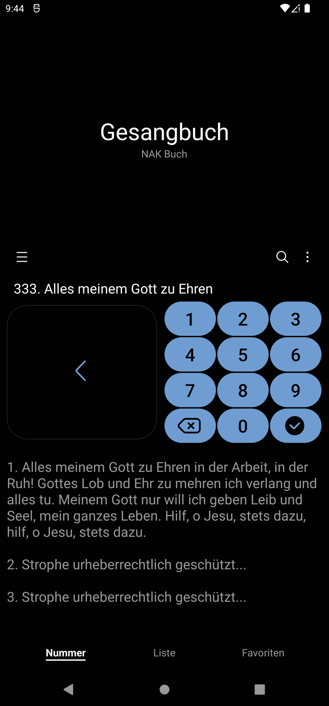
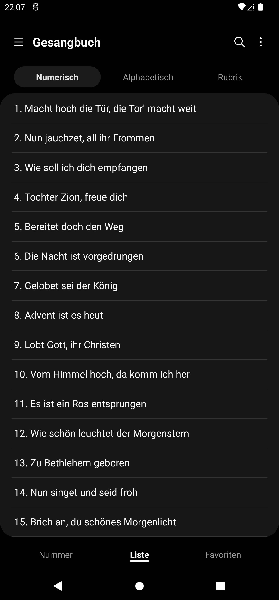
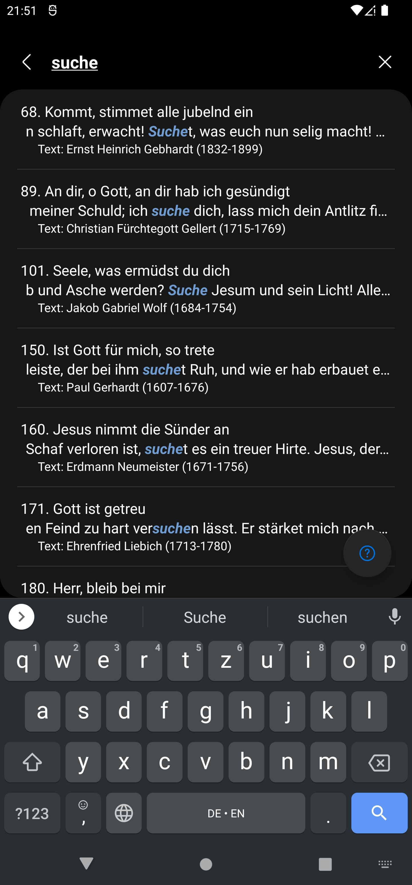

<h2 align="center">
  

</h2>

  
  
  
  

  
  
  
  

# NAK Buch (Gesang und Chorbuch)
Die neue nicht-offizielle Gesang- und Chorbuch-App der Neuapostolischen Kirche.

Diese App steht in keiner Verbindung zur NAK oder dem Friedrich Bischoff Verlag und beinhaltet lediglich die urheberrechtsfreien Texte aus dem Gesang- und Chorbuch der NAK.

Bei 118 (von 438) Gesangbuch-Liedern und 256 (von 462) Chorbuch-Liedern liegen die Rechte noch bei den Urhebern, weshalb diese nicht angezeigt werden können. Die Informationen zum Urheberrecht der einzelnen Lieder wurden mit großer Sorgfalt geprüft, wenn mir hierbei unwissend Fehler unterlaufen sind, bitte ich freundlichst um einen Hinweis, dem ich unverzüglich nachgehen werde.

Die Verwaltung der Rechte obliegt u.a. dem Friedrich Bischoff Verlag, welcher selbst eine (kostenpflichtige) Gesangbuch-App und eine (kostenpflichtige) Chorbuch-App herausgegeben hat.

 

## ❓Warum dann diese App benutzen?
 
💸 Kostenlos: 
Es gibt bereits eine kostenlose Alternative, diese ist aber etwas in die Jahre gekommen, einige Funktionen fehlen, unterstützt nicht alle Bildschirmformate und zeigt mittlerweile eine Warnung an, dass sie für ältere Versionen geschrieben wurde...

🌙 Dark Mode: 
Schon den "Dark-Mode" der offiziellen App gesehen? Keine Ahnung was dort schief gelaufen ist, aber diese App hat einen "richtigen" Dark-Mode (der sich automatisch den Systemeinstellungen anpasst) und invertiert nicht einfach nur das Textfeld... 😂😅🤦🤦‍♂️ ... 

⌚ Wear OS Unterstützung: 
Smartphone vergessen? Kein Problem, die Textinhalte der App lassen sich Problemlos (in angenehmem Design) auf der Smartwatch anzeigen.

 

## ✨ Features:
+ Schnell-Einstellung für Stummschalten/Bitte-Nicht-Stören-Modus
+ Angenehme Textansicht
+ Favortiten
+ Notizen
+ Datumsfunktion (Gesungen am...)
+ Integrierte Bildergallerie für Noten (Die App enthält aus urheberrechtlichen Gründen keine Noten und hat außerdem keinen Zugriff auf die Kamera. Die App kann jedoch eine vorinstallierte Kamera-App öffnen und das dort gemachte Foto (komprimiert) in der integrierten Bildergallerie anzeigen.)
+ Verlauf
+ Die App unterstützt Material You Design und Themed Icons: Die App Farbe des Icons passt sich automatisch dem Hintergrund auf dem Startbildschirm an. (Ab kommenden Android 13, bei Samsung-Geräten bereits ab Android 12: Einstellungen -> Hintergrundbild und Stil -> Farbpalette)

🥚 (Easter Eggs - Schaffst du es "Master of Easter Eggs" zu werden? 😂)

 

## Informationen zum Datenschutz:
Die App erhebt oder teilt keine Nutzerdaten.

 

---

# Download:
https://play.google.com/store/apps/details?id=de.lemke.nakbuch

 

---
Projekt in Mobile-App-Development an der HFU

---
   

# NAK Book (Hymn and Choir Book)
The new non-official song and choir book app of the New Apostolic Church.

This app has no affiliation with the NAC or the Friedrich Bischoff Publishing House and contains only the copyright-free texts from the NAC Hymnal and Choir Book.

For 118 (out of 438) hymnal songs and 256 (out of 462) choirbook songs, the rights are still held by the authors, which is why they cannot be displayed. The information on the copyright of the individual songs has been checked with great care. If I have unwittingly made mistakes, please let me know and I will follow up immediately.

The administration of the rights is the responsibility of, among others, the Friedrich Bischoff Verlag, which itself has published a (paid) hymnal app and a (paid) choir book app.

 

## ❓Why use this app then?
 
💸 Free: 
There is already a free alternative, but it is a bit outdated, lacks some features, doesn't support all screen formats, and now displays a warning that it was written for older versions....

🌙 Dark Mode: 
Already seen the "dark mode" of the official app? Keine Ahnung was dort schief gelaufen ist, aber diese App hat einen "richtigen" Dark-Mode (der sich automatisch den Systemeinstellungen anpasst) und invertiert nicht einfach nur das Textfeld... 😂😅🤦🤦‍♂️ ... 

⌚ Wear OS Unterstützung: 
Smartphone vergessen? No problem, the text contents of the app can be displayed on the smartwatch without any problems (in a pleasant design).

 

## ✨ Features:
+ Quick setting for mute/do not disturb mode.
+ Pleasant text view
+ Favourites
+ Notes
+ Datumsfunktion (Gesungen am...)
+ Integrierte Bildergallerie für Noten (Die App enthält aus urheberrechtlichen Gründen keine Noten und hat außerdem keinen Zugriff auf die Kamera. Die App kann jedoch eine vorinstallierte Kamera-App öffnen und das dort gemachte Foto (komprimiert) in der integrierten Bildergallerie anzeigen.)
+ Verlauf
+ Die App unterstützt Material You Design und Themed Icons: Die App Farbe des Icons passt sich automatisch dem Hintergrund auf dem Startbildschirm an. (Ab kommenden Android 13, bei Samsung-Geräten bereits ab Android 12: Einstellungen -> Hintergrundbild und Stil -> Farbpalette)

🥚 (Easter Eggs - Can you become "Master of Easter Eggs"? 😂)

 

## Privacy Information:
The app does not collect or share user data.

 

---

# Download:
https://play.google.com/store/apps/details?id=de.lemke.nakbuch

 

---
Project in Mobile-App-Development at HFU

